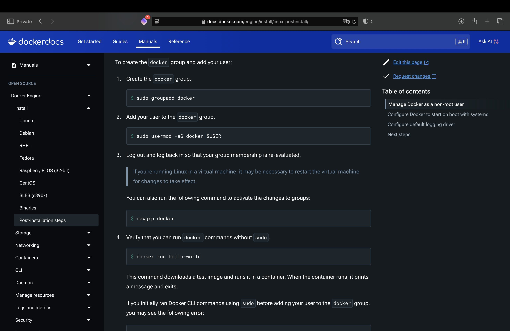
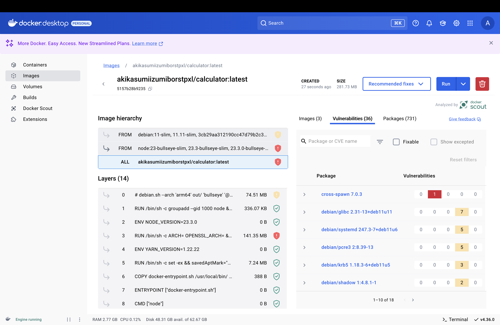

Vul onderstaande aan met de antwoorden op de vragen uit de readme.md file. Wil je de oplossingen file van opmaak voorzien? Gebruik dan [deze link](https://github.com/adam-p/markdown-here/wiki/Markdown-Cheatsheet) om informatie te krijgen over
opmaak met Markdown.

a) voor de sudo niet te gebruiken zien de volgende commandos gebruiks

voor de docker inlog is rechtstreeks met de credentials afgeraden, dan krijgt men de melding dat men het wachtwoord via echo moet doorgeven.

tevens was vanwege mogelijk ander kernel het makkelijker om in de Dockerfile de git te clonen, en de ongewenste bestanden te verwijderen. de docker analyse gaf nog een kwetsbaarheid welke ik met een npm update heb geneutraliseerd, je mag verwachten dat een ontwikkelaar bij deployment een zo veilig mogelijke app publiceerd en niet waar bij voorbaat al kwetsbaarheden in zitten. dus is er al basis ook de nieuwste slim node.js base images gebruikt. slim vanwege de natuurlijk significant kleinere volume

mijn dockerfiles zijn op een apple silicon mac gebouwd in linux, echter heb ik niet in jenkins rosseta gebruikt, dit zou theoretisch moeten kunnen, dus de images zijn arm64v8 gebasseerd, gelieve hiermee ook rekening te houden bij aws, hier is dus ook een arm64 ec2 gebruikt

b) voor het verbinden met de aws ec2 heb ik niet gebruik gemaakt van ssh-agent plugin, dit is namelijk ook volgens de plugin informatie ook zonder mogelijk. withcredentials heeft namelijk de file optie, effecties sla je dan de key van aws die je bij creatie kan downloaden in de credentials manager en die geeft die file dan door als variabele, dit leek meer op de situatie zoals men lokaal zou gebruiken. daardoor is er ook met het gemak van aanpasbaarheid voor gekozen om de username niet in de variable mee te geven wat bij de credentials file niet mogelijk is. ook al bevat de file natuurlijk gewoon een key die als tekst gekopieerd kan worden.

natuurlijk was installatie van docker nodig via snap
en de setup zoals bij deel a, met een reboot voor het effect
